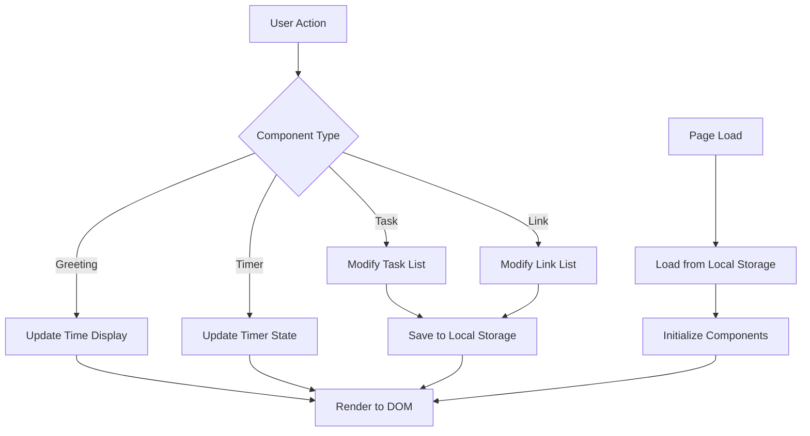

# Design Document: Productivity Dashboard

## Overview

The Productivity Dashboard is a single-page web application built with vanilla HTML, CSS, and JavaScript. It provides a minimal, distraction-free interface for personal productivity with four main components: a time-based greeting display, a 25-minute focus timer, a task management system, and quick links to favorite websites.

The application is entirely client-side with no backend dependencies. All data persistence is handled through the browser's Local Storage API, making it lightweight, fast, and privacy-focused. The architecture emphasizes simplicity, maintainability, and responsive user interactions.

### Key Design Principles

- **Zero Dependencies**: Pure vanilla JavaScript with no frameworks or libraries
- **Client-Side Only**: No server required, runs entirely in the browser
- **Instant Feedback**: All interactions provide immediate visual response
- **Data Persistence**: Automatic saving to Local Storage on every change
- **Browser Compatibility**: Works on all modern browsers (Chrome 90+, Firefox 88+, Edge 90+, Safari 14+)

## Architecture

### System Architecture

The application follows a component-based architecture where each feature is encapsulated in its own module. The architecture consists of three layers:

```
┌─────────────────────────────────────────┐
│         Presentation Layer              │
│  (HTML + CSS + DOM Manipulation)        │
└─────────────────────────────────────────┘
                  ↕
┌─────────────────────────────────────────┐
│         Component Layer                 │
│  ┌──────────┐  ┌──────────┐            │
│  │ Greeting │  │  Timer   │            │
│  └──────────┘  └──────────┘            │
│  ┌──────────┐  ┌──────────┐            │
│  │  Tasks   │  │  Links   │            │
│  └──────────┘  └──────────┘            │
└─────────────────────────────────────────┘
                  ↕
┌─────────────────────────────────────────┐
│         Storage Layer                   │
│      (Local Storage API)                │
└─────────────────────────────────────────┘
```

### Component Interaction Flow



### File Structure

```
productivity-dashboard/
├── index.html           # Main HTML structure
├── css/
│   └── styles.css      # All styling
└── js/
    └── app.js          # All JavaScript logic
```

## Components and Interfaces

### 1. Greeting Display Component

**Purpose**: Display current time, date, and time-based greeting message

**Public Interface**:
```javascript
GreetingDisplay {
  init(): void
  updateDisplay(): void
  getGreeting(hour: number): string
  formatTime(date: Date): string
  formatDate(date: Date): string
}
```

**Behavior**:
- Updates every second using `setInterval`
- Determines greeting based on current hour (5-11: morning, 12-16: afternoon, 17-20: evening, 21-4: night)
- Formats time in 12-hour format with AM/PM
- Formats date in readable format (e.g., "Monday, January 15, 2024")

### 2. Focus Timer Component

**Purpose**: Provide a 25-minute countdown timer for focused work sessions

**Public Interface**:
```javascript
FocusTimer {
  init(): void
  start(): void
  stop(): void
  reset(): void
  tick(): void
  formatTime(seconds: number): string
  updateDisplay(): void
}
```

**State**:
- `remainingSeconds`: number (0-1500)
- `isRunning`: boolean
- `intervalId`: number | null

**Behavior**:
- Initializes to 1500 seconds (25 minutes)
- Counts down by 1 second when running
- Stops automatically at 0
- Can be paused and resumed
- Displays time in MM:SS format

### 3. Task List Component

**Purpose**: Manage user tasks with CRUD operations

**Public Interface**:
```javascript
TaskList {
  init(): void
  addTask(text: string): boolean
  editTask(id: string, newText: string): boolean
  toggleComplete(id: string): void
  deleteTask(id: string): void
  loadTasks(): void
  saveTasks(): void
  renderTasks(): void
  validateTaskText(text: string): boolean
}
```

**State**:
- `tasks`: Array<Task>

**Behavior**:
- Validates task text (non-empty, non-whitespace)
- Generates unique IDs for each task
- Maintains task order (creation order)
- Persists to Local Storage on every change
- Loads from Local Storage on initialization

### 4. Quick Links Component

**Purpose**: Store and display clickable links to favorite websites

**Public Interface**:
```javascript
QuickLinks {
  init(): void
  addLink(name: string, url: string): boolean
  deleteLink(id: string): void
  loadLinks(): void
  saveLinks(): void
  renderLinks(): void
  validateUrl(url: string): boolean
}
```

**State**:
- `links`: Array<Link>

**Behavior**:
- Validates URL format
- Opens links in new tab
- Persists to Local Storage on every change
- Loads from Local Storage on initialization

### 5. Storage Manager

**Purpose**: Abstract Local Storage operations

**Public Interface**:
```javascript
StorageManager {
  save(key: string, data: any): void
  load(key: string): any | null
  remove(key: string): void
}
```

**Behavior**:
- Serializes data to JSON before saving
- Deserializes JSON when loading
- Handles storage errors gracefully
- Returns null for missing keys

## Data Models

### Task Model

```javascript
interface Task {
  id: string;           // Unique identifier (UUID or timestamp-based)
  text: string;         // Task description
  completed: boolean;   // Completion status
  createdAt: number;    // Timestamp (milliseconds since epoch)
}
```

**Validation Rules**:
- `text`: Must be non-empty and contain at least one non-whitespace character
- `id`: Must be unique within the task list
- `completed`: Defaults to false
- `createdAt`: Set automatically on creation

### Link Model

```javascript
interface Link {
  id: string;           // Unique identifier (UUID or timestamp-based)
  name: string;         // Display name for the link
  url: string;          // Full URL including protocol
  createdAt: number;    // Timestamp (milliseconds since epoch)
}
```

**Validation Rules**:
- `name`: Must be non-empty
- `url`: Must be a valid URL format (http:// or https://)
- `id`: Must be unique within the link list
- `createdAt`: Set automatically on creation

### Timer State Model

```javascript
interface TimerState {
  remainingSeconds: number;  // 0-1500
  isRunning: boolean;        // Current running state
}
```

### Local Storage Schema

**Storage Keys**:
- `productivity-dashboard-tasks`: JSON array of Task objects
- `productivity-dashboard-links`: JSON array of Link objects

**Example Storage Data**:
```json
{
  "productivity-dashboard-tasks": [
    {
      "id": "task-1234567890",
      "text": "Complete project proposal",
      "completed": false,
      "createdAt": 1704067200000
    }
  ],
  "productivity-dashboard-links": [
    {
      "id": "link-1234567890",
      "name": "GitHub",
      "url": "https://github.com",
      "createdAt": 1704067200000
    }
  ]
}
```


## Correctness Properties

*A property is a characteristic or behavior that should hold true across all valid executions of a system—essentially, a formal statement about what the system should do. Properties serve as the bridge between human-readable specifications and machine-verifiable correctness guarantees.*

### Property 1: Time Format Validation

*For any* Date object, the formatted time output should be in 12-hour format with AM/PM indicator (e.g., "3:45 PM", "11:30 AM")

**Validates: Requirements 1.1**

### Property 2: Date Format Validation

*For any* Date object, the formatted date output should be in a human-readable format containing the day of week, month name, day, and year

**Validates: Requirements 1.2**

### Property 3: Greeting Message Correctness

*For any* hour value (0-23), the greeting function should return "Good morning" for hours 5-11, "Good afternoon" for hours 12-16, "Good evening" for hours 17-20, and "Good night" for hours 21-4

**Validates: Requirements 1.3, 1.4, 1.5, 1.6**

### Property 4: Timer Format Validation

*For any* number of seconds between 0 and 1500, the timer format function should return a string in MM:SS format where MM is zero-padded minutes and SS is zero-padded seconds

**Validates: Requirements 2.2**

### Property 5: Timer Start State Transition

*For any* timer state, calling start() should set isRunning to true and preserve the current remainingSeconds value

**Validates: Requirements 2.3**

### Property 6: Timer Stop Preserves Time

*For any* timer state where isRunning is true, calling stop() should set isRunning to false and preserve the current remainingSeconds value

**Validates: Requirements 2.4**

### Property 7: Timer Reset Returns to Initial State

*For any* timer state, calling reset() should set remainingSeconds to 1500 and isRunning to false

**Validates: Requirements 2.5**

### Property 8: Task Addition Increases List Size

*For any* task list and any valid (non-empty, non-whitespace) task text, adding the task should increase the list length by exactly one and the new task should appear in the list

**Validates: Requirements 3.1**

### Property 9: Task Edit Updates Text

*For any* task in the list and any valid new text, editing the task should change its text property to the new value while preserving its id and createdAt

**Validates: Requirements 3.2**

### Property 10: Task Completion Toggle

*For any* task in the list, toggling its completion status should flip the completed boolean value

**Validates: Requirements 3.3**

### Property 11: Task Deletion Removes from List

*For any* task in the list, deleting that task should decrease the list length by exactly one and the task should no longer appear in the list

**Validates: Requirements 3.4**

### Property 12: Task Order Preservation

*For any* sequence of task additions, the task list should maintain the tasks in the order they were created (by createdAt timestamp)

**Validates: Requirements 3.5**

### Property 13: Invalid Task Rejection

*For any* string that is empty or contains only whitespace characters, attempting to add it as a task should be rejected and the task list should remain unchanged

**Validates: Requirements 3.6**

### Property 14: Task Storage Persistence

*For any* task operation (add, edit, toggle, delete), the resulting task list should be immediately saved to Local Storage and match the in-memory state

**Validates: Requirements 4.1, 4.2, 4.3, 4.4**

### Property 15: Task Storage Round-Trip

*For any* array of valid tasks, saving to Local Storage and then loading should produce an equivalent task list with all properties preserved

**Validates: Requirements 4.5**

### Property 16: Link Addition Increases List Size

*For any* link list and any valid name and URL, adding the link should increase the list length by exactly one and the new link should appear in the list

**Validates: Requirements 5.1**

### Property 17: Link Deletion Removes from List

*For any* link in the list, deleting that link should decrease the list length by exactly one and the link should no longer appear in the list

**Validates: Requirements 5.3**

### Property 18: Invalid URL Rejection

*For any* URL string that is empty or does not start with "http://" or "https://", attempting to add it as a link should be rejected and the link list should remain unchanged

**Validates: Requirements 5.5**

### Property 19: Link Storage Persistence

*For any* link operation (add, delete), the resulting link list should be immediately saved to Local Storage and match the in-memory state

**Validates: Requirements 6.1, 6.2**

### Property 20: Link Storage Round-Trip

*For any* array of valid links, saving to Local Storage and then loading should produce an equivalent link list with all properties preserved

**Validates: Requirements 6.3**

## Error Handling

### Input Validation Errors

**Task Text Validation**:
- Empty strings or whitespace-only strings are rejected silently
- No error messages displayed to user
- Task list remains unchanged
- No data is saved to Local Storage

**URL Validation**:
- Invalid URLs (missing protocol, empty) are rejected silently
- No error messages displayed to user
- Link list remains unchanged
- No data is saved to Local Storage

### Storage Errors

**Local Storage Unavailable**:
- Application continues to function with in-memory state only
- User is notified that data will not persist
- All features remain operational within the session

**Storage Quota Exceeded**:
- Attempt to save fails gracefully
- User is notified of storage limit
- Existing data is preserved
- User can delete items to free space

**Corrupted Storage Data**:
- Invalid JSON is caught during load
- Application initializes with empty state
- Corrupted data is cleared from storage
- User can start fresh

### Timer Edge Cases

**Timer at Zero**:
- Timer automatically stops when reaching 0
- Start button can restart from 0
- Reset button returns to 25 minutes

**Rapid Button Clicks**:
- Multiple rapid clicks are handled gracefully
- State transitions are atomic
- No race conditions in timer updates

## Testing Strategy

### Overview

The testing strategy employs a dual approach combining unit tests for specific examples and edge cases with property-based tests for comprehensive validation of universal properties. This ensures both concrete correctness and general behavioral guarantees.

### Property-Based Testing

**Framework**: We will use **fast-check** for JavaScript property-based testing.

**Configuration**:
- Each property test runs a minimum of 100 iterations
- Tests use random input generation to cover the input space
- Each test references its corresponding design property

**Test Tagging Format**:
```javascript
// Feature: productivity-dashboard, Property 1: Time Format Validation
```

**Property Test Coverage**:
- All 20 correctness properties will be implemented as property-based tests
- Properties 1-3: Greeting display formatting and logic
- Properties 4-7: Timer operations and state transitions
- Properties 8-15: Task management and persistence
- Properties 16-20: Link management and persistence

**Generator Strategy**:
- Date generators for time/date testing
- Number generators (0-1500) for timer seconds
- String generators for task text (including whitespace variations)
- URL generators (valid and invalid formats)
- Task/Link object generators with random properties

### Unit Testing

**Framework**: We will use **Jest** for unit testing with jsdom for DOM manipulation testing.

**Unit Test Focus**:
- Specific examples demonstrating correct behavior
- Edge cases identified in requirements (timer at 0, empty storage)
- Integration between components and storage layer
- DOM manipulation and event handling
- Initial state verification (timer starts at 1500 seconds, etc.)

**Example Unit Tests**:
- Timer initializes to 25 minutes (1500 seconds)
- Empty storage loads as empty list
- Timer stops automatically at zero
- Greeting display positioned at top of layout
- Font size is minimum 14px
- File structure matches specification

### Test Organization

```
tests/
├── unit/
│   ├── greeting.test.js
│   ├── timer.test.js
│   ├── tasks.test.js
│   ├── links.test.js
│   └── storage.test.js
└── properties/
    ├── greeting.properties.test.js
    ├── timer.properties.test.js
    ├── tasks.properties.test.js
    ├── links.properties.test.js
    └── storage.properties.test.js
```

### Testing Balance

- Property-based tests handle comprehensive input coverage through randomization
- Unit tests focus on specific examples, edge cases, and integration points
- Both approaches are necessary and complementary
- Avoid writing excessive unit tests for cases already covered by properties
- Use unit tests for DOM interactions and browser-specific behavior
- Use property tests for data transformations and business logic

### Manual Testing

**Browser Compatibility**:
- Manual testing required across Chrome 90+, Firefox 88+, Edge 90+, Safari 14+
- Verify all features work consistently across browsers
- Test Local Storage behavior in each browser

**Performance Testing**:
- Manual verification of load time (< 1 second)
- Manual verification of interaction responsiveness (< 100ms)
- Test with 100 tasks and 50 links to verify performance

**Visual Design**:
- Manual review of color scheme consistency
- Manual review of visual hierarchy and spacing
- Manual review of hover and click states
- Manual review of responsive layout

